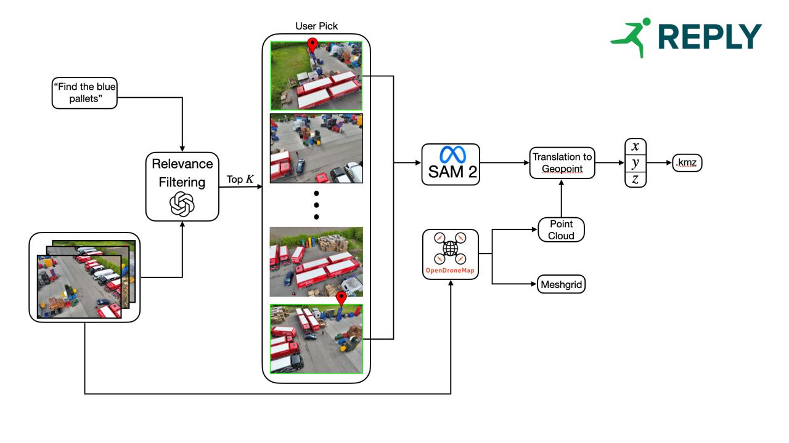

# Team Waypoint to Mensa: Makeathon 2025 Submission

 *Team Members: Vincent Limbach, Damian Hattler, Menalaos Fotiadis, Kesava Prasad Arul*

### Developer Notes:
* The repository consists of several services, as depicted in the picture above.
* Each service has their own Docker file and are also hosted here:
    * Dataset Engine: [https://dataset.kesava.lol](https://dataset.
    kesava.lol)
    * Open Drone Map: [https://opendrone.kesava.lol](https://opendrone.kesava.lol)
    * Segmentation Engine: [https://point_api.kesava.lol](https://point_api.kesava.lol)
    * Pixel to Geopoint Translation Engine: [https://pixeltranslate.kesava.lol](https://pixeltranslate.kesava.lol)
    * KML Generator: [https://kmlgen.kesava.lol](https://kmlgen.kesava.lol)

Each folder has their own organizational structure, although fairly straight forward. All services are hosted via CloudFlare, and DockerHub for Image Management.

